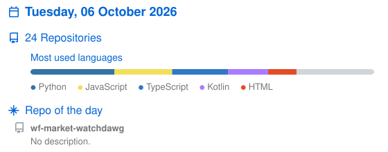

<h1 align="center">Yo, I'm James ^-^</h1>

  <em>obsessive ricer · homelab enjoyer · arch user (btw) · and neovim too (btw)</em> 
  <!-- <a href="https://yoursite.dev">yoursite.dev</a> · -->
  Add me on Discord: <code>contessa.</code> · <a href="https://steamcommunity.com/id/fortunaptv">Steam</a> ·
  <a href="https://www.youtube.com/@contessa420">YouTube</a>

<picture>
  <source
    media="(prefers-color-scheme: dark)"
    srcset="https://raw.githubusercontent.com/j-ameswong/github-readme/main/output/contribs-dark.svg"
  />
  
</picture>

---

  <!-- Regenerated daily by scripts/update_profile.py -->
  

---

###  SWE larp log
<!-- ACTIVITY:START -->
 Pushed to [j-ameswong/j-ameswong](https://github.com/j-ameswong/j-ameswong) 
 Pushed to [j-ameswong/bad-apple-ify](https://github.com/j-ameswong/bad-apple-ify) 
 Pushed to [j-ameswong/tag-matching-jev](https://github.com/j-ameswong/tag-matching-jev) 
 Pushed to [j-ameswong/mentee-mentor-matching](https://github.com/j-ameswong/mentee-mentor-matching) 
 Pushed to [j-ameswong/assessment-management](https://github.com/j-ameswong/assessment-management)
<!-- ACTIVITY:END -->

###  Live deployments
<!-- DEPLOYMENTS:START -->
- [assign-me](https://assignme-weld.vercel.app/)  up · 241 ms · [repo](https://github.com/j-ameswong/assign-me)
- [uxhack](https://uxhack-snakeup.vercel.app/signup)  up · 142 ms · [repo](https://github.com/j-ameswong/uxhack)
- [assessment-manager](https://assessment-manager-fawn.vercel.app/)  up · 108 ms · [repo](https://github.com/j-ameswong/assessment-management)
- [UniConnect](https://uniconnect-portfolio.vercel.app/)  up · 101 ms · [repo](https://github.com/j-ameswong/mentee-mentor-matching)
- [bad-apple-ify](https://bad-apple-ify.vercel.app/)  up · 209 ms · [repo](https://github.com/j-ameswong/bad-apple-ify)
<!-- DEPLOYMENTS:END -->

###  Homelab
<!-- HOMELAB:START -->
 Server up 2 weeks, 4 days, 2 hours, 47 minutes 
 4 containers running 
 Tailnet Running: 0/26 peers online
<!-- HOMELAB:END -->

###  Stuff I've talked to AI a lot about
`Java` · `Python` · `Postgres` · `Docker` · `Spring` · `React`

###  Latest hyperfixation
Currently looking into text embedding + Jev as a decision layer for semantic matching

<em>Last refreshed: <!-- UPDATED:START -->2026-10-06 23:17 UTC<!-- UPDATED:END --> via systemd timer</em>

